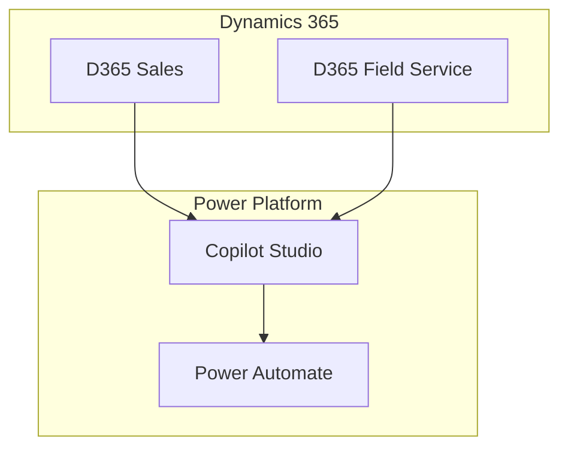

# Artifact Generation Skills Architecture

## Overview

Your D365 Architect agent can now generate **management consulting-level artifacts** including:
- 📊 PowerPoint presentations (architecture, strategy, findings)
- 📈 Excel dashboards and analyses
- 🔲 Process flow and architecture diagrams (Mermaid, Visio, BPMN)
- 🎨 Figma design prototypes
- 📦 Complete deliverable bundles

This is powered by a **reusable skills architecture** that can be invoked from:
- Backend Python code
- Copilot Studio agent actions
- MCP tools for other AI agents
- REST API endpoints

---

## Architecture

```
┌─────────────────────────────────────────────────────────────┐
│                    Agent/User Request                        │
└────────────────────┬────────────────────────────────────────┘
                     │
        ┌────────────┴────────────┐
        │                         │
        ▼                         ▼
┌──────────────────┐      ┌──────────────────┐
│  Agent Prompts   │      │  MCP Tool Calls  │
│  (System Mode)   │      │  (from Studio)   │
└────────┬─────────┘      └────────┬─────────┘
         │                         │
         └────────────┬────────────┘
                      │
                      ▼
         ┌────────────────────────┐
         │  Skills Registry       │
         │  (Orchestrator)        │
         └────────────┬───────────┘
                      │
        ┌─────────────┼─────────────┐
        │             │             │
        ▼             ▼             ▼
    ┌───────┐   ┌─────────┐   ┌────────────┐
    │PowerPt│   │ Excel   │   │ Diagrams   │
    │ Skill │   │ Skill   │   │ Skill      │
    └───────┘   └─────────┘   └────────────┘
        │             │             │
        ▼             ▼             ▼
    .pptx        .xlsx          .md (Mermaid)
    (+ .pdf)     + charts       + .vsdx (Visio)
                                + .bpmn
```

---

## How to Use: Three Patterns

### Pattern 1: Direct Python Invocation

```python
from backend.services.artifact_skills import SkillsRegistry

registry = SkillsRegistry()

# Generate PowerPoint
context = {
    "architecture_summary": "Implement AI-first D365 Field Service with Copilot-assisted dispatch",
    "recommendations": [
        "Deploy Copilot Studio for custom dispatch agents",
        "Integrate MCP for skill orchestration",
        "Enable Responsible AI governance"
    ],
    "risks": [
        {
            "risk": "AI Model Drift",
            "mitigation": "Implement continuous model evaluation and retraining"
        }
    ],
    "benefits": [
        "30% faster dispatch times",
        "25% reduction in field service costs",
        "Improved technician adoption"
    ]
}

result = registry.invoke_skill("powerpoint", context,
    template_type="strategy_recommendation",
    customer_name="Ecolab"
)

print(result["artifact_path"])  # /path/to/Ecolab_architecture_20260724_083000.pptx
```

### Pattern 2: MCP Tool Call (from Copilot Studio)

In your **Copilot Studio agent**, add an **action** that calls the MCP tool:

```yaml
# Copilot Studio Agent Configuration
actions:
  - name: "Generate Architecture Deck"
    type: "mcp_tool"
    tool_name: "generate_powerpoint_deck"
    parameters:
      template_type: "strategy_recommendation"
      customer_name: "{{ customer_name }}"
      architecture_summary: "{{ agent_analysis.summary }}"
      recommendations: "{{ agent_analysis.recommendations }}"
      risks: "{{ agent_analysis.risks }}"
      benefits: "{{ agent_analysis.benefits }}"
    output_variable: "artifact"
```

### Pattern 3: REST API Call

```bash
curl -X POST https://your-d365-architect-api/artifacts/powerpoint \
  -H "Content-Type: application/json" \
  -d '{
    "template_type": "strategy_recommendation",
    "customer_name": "Ecolab",
    "architecture_summary": "...",
    "recommendations": ["..."],
    "risks": [{"risk": "...", "mitigation": "..."}]
  }'

# Response:
{
  "success": true,
  "artifact_path": "/generated_decks/Ecolab_architecture_20260724.pptx",
  "artifact_type": "powerpoint",
  "template_used": "strategy_recommendation",
  "slide_count": 11
}
```

---

## Available Skills

### 1. **PowerPoint Deck Generator**

**Templates Available:**
- `strategy_recommendation` - Strategy and architecture recommendation deck
- `architecture_deep_dive` - Technical architecture deep-dive
- `findings_report` - Assessment findings and recommendations
- `implementation_roadmap` - Phased implementation plan

**Example Usage:**
```python
result = registry.invoke_skill("powerpoint", context,
    template_type="architecture_deep_dive",
    customer_name="Ecolab",
    output_path="./customer_deliverables"
)

# Output: .pptx with 11 pre-formatted slides
#  - Title slide
#  - Executive summary
#  - Current state analysis
#  - Proposed architecture (with diagram placeholder)
#  - Integration design
#  - Benefits and success metrics
#  - Risk mitigation
#  - Implementation timeline
#  - ... and more
```

**Context Data Expected:**
```python
{
    "architecture_summary": str,
    "recommendations": List[str],  # Max 5 shown per slide
    "risks": List[{"risk": str, "impact": str, "mitigation": str}],
    "benefits": List[str],
    "success_metrics": List[str],
    "roadmap": List[str]  # Phase descriptions
}
```

---

### 2. **Excel Dashboard Generator**

**Dashboard Types:**
- `cost_benefit` - Cost/benefit analysis with ROI
- `integration_inventory` - Systems and integration points
- `risk_assessment` - Risk matrix and mitigation
- `implementation_timeline` - Phases with resources
- `comparison_matrix` - Solution option comparison

**Example Usage:**
```python
result = registry.invoke_skill("excel", context,
    dashboard_type="risk_assessment",
    customer_name="Ecolab"
)

# Output: .xlsx with formatted sheets:
#  - Executive summary
#  - Risk register with impact/probability
#  - Mitigation strategies
#  - Charts and visualizations
```

---

### 3. **Process Flow Diagram Generator**

**Diagram Types:**
- `architecture` - Solution architecture diagram
- `integration` - Integration flow diagram
- `process` - Business process flow
- `dataflow` - Data flow diagram (DFD)
- `swimlane` - Swimlane process diagram

**Output Formats:**
- `mermaid` - Markdown-embedded Mermaid (default, easy to version control)
- `bpmn` - BPMN XML (professional notation)
- `svg` / `png` - Rendered images

**Example Usage:**
```python
result = registry.invoke_skill("process_flow", context,
    diagram_type="architecture",
    output_format="mermaid"
)

# Output: Markdown file with Mermaid diagram
# Can be rendered in GitHub, Confluence, etc.

# To convert to Visio/PNG:
result = registry.invoke_skill("process_flow", context,
    diagram_type="architecture",
    output_format="svg"
)
```

**Generated Diagram (Mermaid):**


---

### 4. **Figma Design Asset Generator** (Coming Soon)

**Asset Types:**
- `ui_mockup` - UI mockups for new features
- `user_journey_map` - User experience journey
- `workflow_prototype` - Interactive prototype
- `design_system` - Design system components
- `wireframe` - Low-fidelity wireframes

**Requirements:**
- Figma API token (securely stored in environment)
- figma-api Python package

---

### 5. **Visio Diagram Generator** (Coming Soon)

**Diagram Types:**
- `network_diagram` - Network topology
- `database_diagram` - ER diagrams
- `flowchart` - Traditional flowcharts
- `organization_chart` - Org structure
- `timeline` - Timeline diagrams

---

### 6. **Artifact Bundle Generator**

**Generates complete customer deliverable package in one call:**

```python
result = registry.invoke_skill("bundle", context,
    bundle_type="architecture_recommendation",
    customer_name="Ecolab",
    include_powerpoint=True,
    include_excel=True,
    include_diagrams=True,
    include_documentation=True
)

# Output: Single timestamped folder containing:
#  - Ecolab_architecture_20260724/
#    ├── 1_Strategy_Recommendation.pptx
#    ├── 2_Analysis_Dashboard.xlsx
#    ├── 3_Architecture_Diagram.md (Mermaid)
#    ├── 4_Integration_Flows.md (Mermaid)
#    ├── 5_Implementation_Plan.md
#    └── manifest.json (metadata)
```

---

## Integration with Copilot Studio

### Step 1: Register MCP Tools

In your Copilot Studio **Agent Configuration**, import the MCP tools:

```yaml
integrations:
  - type: "mcp_tools"
    source: "d365-architect-mcp"
    tools:
      - "generate_powerpoint_deck"
      - "generate_excel_dashboard"
      - "generate_process_flow_diagram"
      - "generate_artifact_bundle"
```

### Step 2: Add Agent Actions

Create an agent action that invokes the tools:

```yaml
topics:
  - name: "Generate Customer Deliverables"
    trigger: "user asks to generate a deck, presentation, or deliverable"
    actions:
      - "Analyze the architecture based on prior conversation"
      - "Call generate_powerpoint_deck with context"
      - "Call generate_process_flow_diagram for visual aids"
      - "Return artifact URLs to user"
```

### Step 3: Test in Agent

```
User: "Create a PowerPoint deck for Ecolab showing our D365 Field Service recommendations"

Agent:
  ✓ Analyzed architecture and recommendations
  ✓ Generated PowerPoint deck: Ecolab_architecture_20260724.pptx
  ✓ Created integration flow diagram: integration_flows.md
  
  📎 Artifacts ready for download:
    - Strategy Recommendation Deck (11 slides)
    - Architecture Diagrams
    - Success Metrics Dashboard
```

---

## Skill Definition Pattern

Each skill follows this pattern (you can add more):

```python
class MyCustomSkill(ArtifactSkill):
    skill_name = "my_custom_skill"
    version = "1.0"
    tags = ["consulting", "custom"]
    supported_formats = ["pdf", "docx"]
    
    def generate(self, context: Dict[str, Any], **kwargs) -> Dict[str, Any]:
        """Generate artifact."""
        # Your implementation
        return {
            "success": True,
            "artifact_path": "/path/to/artifact",
            "artifact_type": "custom",
            "metadata": {...}
        }
    
    def validate(self, config: Dict[str, Any]) -> Tuple[bool, List[str]]:
        """Validate config."""
        errors = []
        # Your validation logic
        return (len(errors) == 0, errors)
```

Register it:
```python
registry = SkillsRegistry()
registry.skills["my_custom"] = MyCustomSkill()
```

---

## Dependencies

Install required packages:

```bash
# PowerPoint generation
pip install python-pptx

# Excel generation
pip install openpyxl

# Figma integration (optional)
pip install figma-api

# Visio integration (optional)
pip install python-vsdx

# Diagram rendering (optional)
pip install mermaid-cli
```

---

## API Reference

### REST Endpoints

| Method | Endpoint | Purpose |
|--------|----------|---------|
| POST | `/artifacts/powerpoint` | Generate PowerPoint |
| POST | `/artifacts/excel` | Generate Excel |
| POST | `/artifacts/diagrams` | Generate diagrams |
| POST | `/artifacts/figma` | Generate Figma asset |
| POST | `/artifacts/visio` | Generate Visio |
| POST | `/artifacts/bundle` | Generate complete bundle |
| GET | `/artifacts/tools` | List available tools |

---

## Next Steps

1. **Test Learn Crawler** - Run `python backend/services/learn_crawler.py` to index Microsoft Learn docs
2. **Wire into Backend** - Add skill invocation to your main agent backend
3. **Create Agent Actions** - Define Copilot Studio actions that call the skills
4. **Add Templates** - Create custom PowerPoint/Excel templates for your branding
5. **Deploy to Production** - Host on Azure App Service or Functions with REST API

---

## Examples

### Generate Ecolab OneCRM Presentation

```python
from backend.services.artifact_skills import SkillsRegistry

registry = SkillsRegistry()

ecolab_context = {
    "architecture_summary": """
    Implement an AI-first Dynamics 365 solution for Ecolab with:
    - D365 Sales for opportunity management with Copilot-assisted insights
    - D365 Field Service with Copilot-assisted dispatch and technician workflows
    - Copilot Studio agents for knowledge management and automation
    - MCP integration for skill orchestration across multiple agents
    """,
    "recommendations": [
        "Deploy Copilot Studio for custom dispatch and knowledge agents",
        "Implement MCP Model Context Protocol for multi-agent orchestration",
        "Enable Responsible AI governance and monitoring",
        "Use D365 Field Service Copilot for dispatcher and technician support",
        "Integrate with Ecolab's existing systems via MuleSoft"
    ],
    "risks": [
        {
            "risk": "AI Model Drift",
            "impact": "High - could reduce dispatch accuracy",
            "mitigation": "Monthly model performance review and retraining"
        },
        {
            "risk": "Technician Adoption",
            "impact": "High - affects ROI",
            "mitigation": "Comprehensive training and change management program"
        }
    ],
    "benefits": [
        "30% improvement in field technician productivity",
        "25% reduction in average dispatch time",
        "20% decrease in customer escalations",
        "15% improvement in resource utilization",
        "Enhanced compliance with Responsible AI practices"
    ],
    "success_metrics": [
        "Dispatch time reduction to <5 minutes average",
        "Technician adoption rate >85%",
        "Customer satisfaction score increase to 4.5+/5.0",
        "ROI achieved within 18 months"
    ],
    "roadmap": [
        "Phase 1 (Months 1-3): Foundation setup and Copilot configuration",
        "Phase 2 (Months 4-6): Field Service Copilot deployment and training",
        "Phase 3 (Months 7-9): Custom agents and MCP integration",
        "Phase 4 (Months 10-12): Optimization and advanced capabilities"
    ]
}

# Generate the deck
result = registry.invoke_skill("powerpoint", ecolab_context,
    template_type="architecture_deep_dive",
    customer_name="Ecolab"
)

print(f"✓ Generated: {result['artifact_path']}")
print(f"  Slides: {result['slide_count']}")
```

---

## Support

For questions or to add new artifact skill types, see:
- `backend/services/artifact_skills.py` - Core skill implementations
- `backend/services/mcp_artifact_tools.py` - MCP tool definitions
- `docs/knowledge-manifest.yaml` - Knowledge grounding

---
